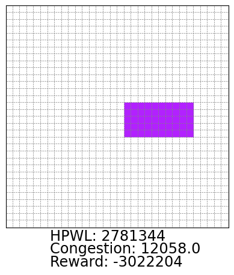

# RL-placement
RL-placement is an automated framework for RL-based chip placement.


## Placement process
1. Place hard macro cells using nerual network trained by deepRL algorithm
2. Place soft macro cells(:=clustered standard cells) by standard cell placer(e.g. heuristic algorithms)

## Training process
To run RL algorithm, following processes are conducted:
1. For every one step, one hard macro cell is placed according to nn output. While placement is not done, reward is evaluated as 0.
2. When hard macro cell placement is done, place soft macro cells.
3. When soft macro cell placement is done, evaluated reward function as the weighted sum of wirelength and routing congestion.
4. Update neural network.



Training process. Soft macro cells are placed by modified force-directed method.


## File tree

```
📦main
 ┣ 📂environment
 ┃ ┣ 📜environment.py
 ┣ 📂model
 ┃ ┣ 📜agent.py
 ┣ 📂netlist
 ┃ ┣ 📜adjacency_matrix
 ┃ ┣ 📜cells
 ┃ ┣ 📜HGraphFile.hgr.part.100
 ┃ ┣ 📜HGraphFile.hgr.part.4
 ┃ ┣ 📜HGraphFile.txt
 ┃ ┣ 📜ispd18_test3.def
 ┃ ┣ 📜ispd18_test3.lef
 ┃ ┣ 📜macro_indices
 ┃ ┗ 📜std_indices
 ┣ 📂oldversions
 ┃ ┣ 📜placement_ispd18test3.ipynb
 ┃ ┗ 📜placement_ispd18test3.pt
 ┣ 📂src
 ┃ ┗ 📜placement_gif_std_nn.gif
 ┣ 📂utils
 ┃ ┣ 📜parsing.ipynb
 ┃ ┣ 📜parsing.py
 ┣ 📜placement.ipynb
 ┣ 📜README.md
```

## Dependencies

| Module | Version |
| --- | --- |
| python | 3.9.16 |
| stable-baselines3 | 2.0.0a5 |
| sb3-contrib | 2.0.0a4 |
| torch | 2.0.1 |
| numpy | 1.24.0 |
| matplotlib | 3.7.1 |

## Run

1. Run `python route_using_model.py --model_name ./model/lambda_50 --lamb 50`

## References

1. [Mirhoseini, A., et al. (2020). Chip Placement with Deep Reinforcement Learning, arXiv:2004.10746(doi: https://doi.org/10.48550/arXiv.2004.10746)](https://arxiv.org/abs/2004.10746)
2. [Yue, S., et al. (2022). Scalability and Generalization of Circuit Training for Chip Floorplanning. Proceedings of the 2022 International Symposium on Physical Design. Virtual Event, Canada, Association for Computing Machinery: 65–70.](https://dl.acm.org/doi/abs/10.1145/3505170.3511478)
3. https://github.com/google-research/circuit_training.git repository
4. https://github.com/DLR-RM/stable-baselines3.git repository